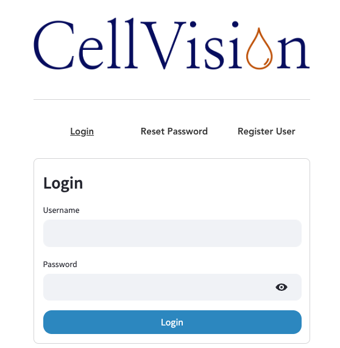
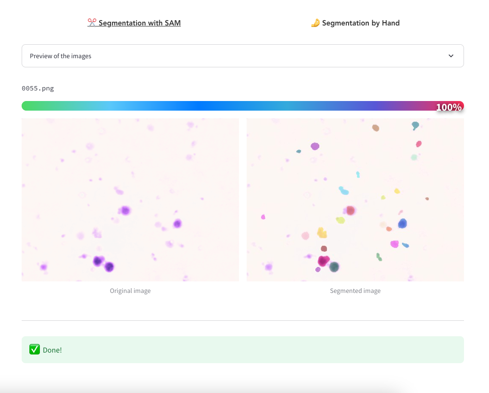
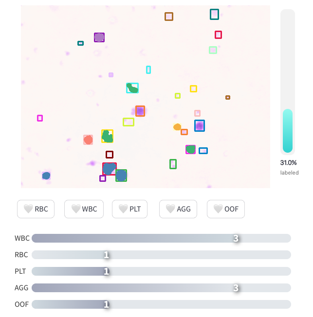
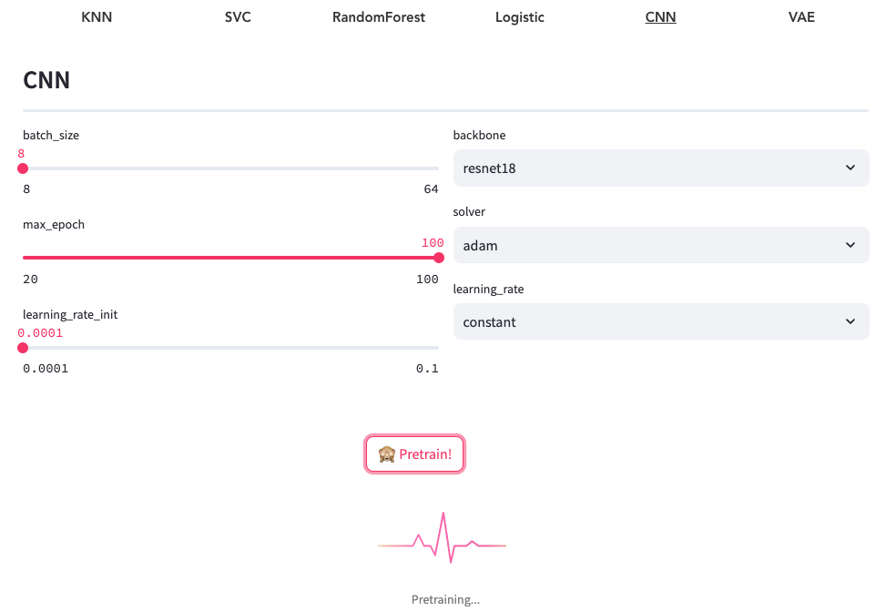
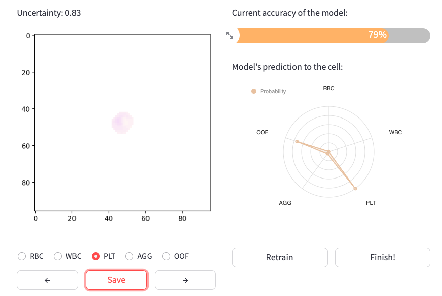
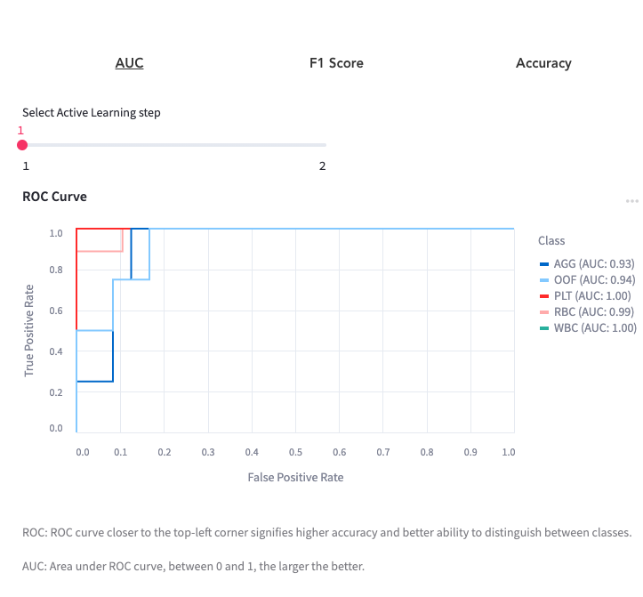
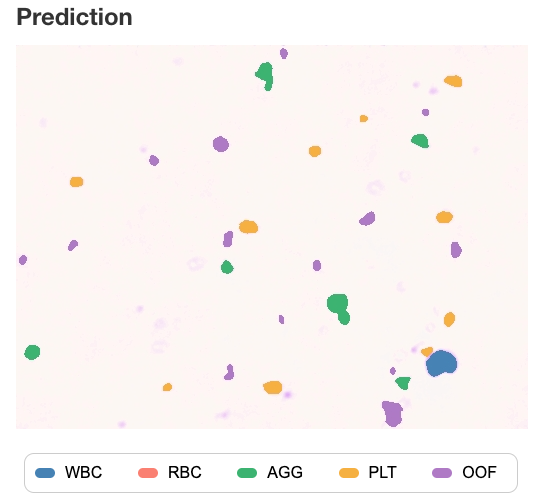
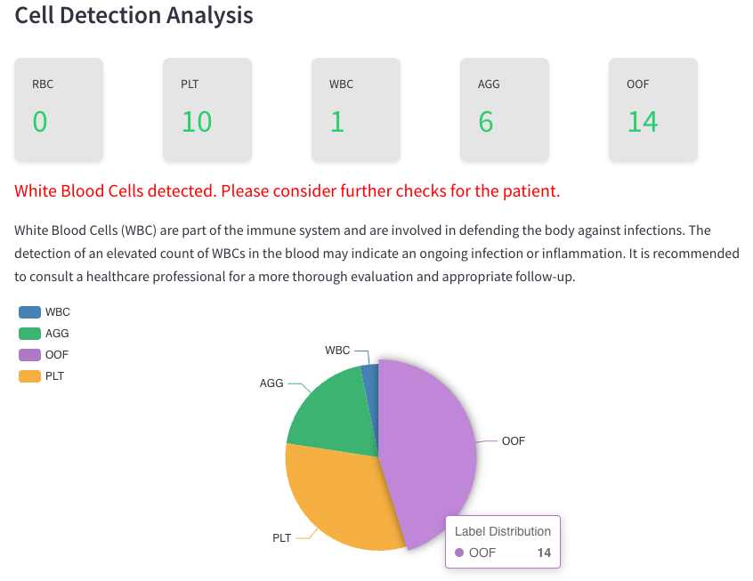

# CellVision
<p align="center">
    
</p>


Welcome to CellVision, an intuitive web application powered by Applied Machine Intelligence! Designed with a focus on cellular data analysis, CellVision streamlines the process of segmentation, labeling, prediction, correction, and visualization of cellular data. It also provides a robust model management system, allowing users to train, evaluate, and deploy machine learning models with ease.

CellVision is not just another data analysis tool - it's a comprehensive solution built by scientists for scientists. It bridges the gap between complex cellular data and actionable insights, providing a platform where users can leverage the power of machine learning without needing extensive programming skills.

Whether you're a researcher trying to decipher the hidden patterns in cellular data, a student embarking on a journey in cellular biology, or a data scientist pushing the boundaries of applied machine learning, CellVision has something to offer.

Explore our features, try out our system, and unlock new possibilities in cellular data analysis!
## Table of Contents

- [CellVision](#cellvision)
  - [Table of Contents](#table-of-contents)
    - [This project is currently hosted on the following website:](#this-project-is-currently-hosted-on-the-following-website)
    - [For logging into the AMI domain:](#for-logging-into-the-ami-domain)
      - [Note: You may need to use VPN if you are not under Munich Scientific Network](#note-you-may-need-to-use-vpn-if-you-are-not-under-munich-scientific-network)
  - [**New Functionality: Secure Registration**](#new-functionality-secure-registration)
  - [Demo](#demo)
  - [Prerequisites](#prerequisites)
  - [Installation](#installation)
  - [Usage](#usage)
  - [Contributor](#contributor)
  - [Contact](#contact)
  - [License](#license)


## **New Functionality: Secure Registration**
⚡️ We are excited to announce a new update to CellVision! You can now register with your email, username, and password. This allows you to create an account and securely store your login information for future access.

## Demo
A demo of the final app can be found on: [](https://youtu.be/y5BfYRBy514)

## Prerequisites

Ensure the following prerequisites are satisfied before you proceed:

- 


- Necessary Python packages as listed in the `app/requirements.txt` file

## Installation

1. Setting Up the Virtual Environment:
   - Open a terminal or command prompt.
   - Create a virtual environment using the Python's built-in venv module with the following command:
        
        ```
        python3 -m venv cellvision
        ```
        
    This will create a new directory named 'cellvision'. Feel free to choose a different name if you prefer.

    - Activate the virtual environment with the following command:
       -  On macOS and Linux:

            ```
            source cellvision/bin/activate
            ```

       -  On Windows:

            ```
            .\cellvision\Scripts\activate
            ```

    You will know the virtual environment is activated when its name appears in your command prompt.    

2. Installing Required Packages:

    ⚡️ Note that PyTorch and torchvision are also required. Please install these packages according to your hardware (e.g. CPU or GPU) following the instructions provided on the official [](https://pytorch.org/get-started/locally/) website.

    Navigate to the 'app' directory and install the necessary packages with the following command:
    
    ```
    cd app
    pip install -r requirements.txt
    ```
        
## Usage

1. Launch the web app by running the following command in the terminal:

    ```
    cd app
    streamlit run 0_🏡_login.py
    ```

2. Open your preferred web browser and navigate to http://localhost:8501.

3. The homepage of the web app will be displayed. Take a moment to read the description and follow the provided instructions.

4. Navigation Menu:

    The web app features a navigation menu located on the left-hand side. This menu provides easy access to the various modules of the application, each dedicated to a specific task. Here's a brief overview of these modules:

    - **Login Module**: The login module serves as the entry point of the application. It provides a simple form for users to input their username and password. Upon successful login, users can proceed to the main part of the application.
    <p align="center">
        
    </p>

    - **Segmentation Module**: This module assists in the segmentation of cell images. It allows users to upload an image, segment it using a selected model, and visualize the segmented image.
    <p align="center">
        
    </p>

    - **Labeling Module**: This module allows the user to manually label the segmented cells by type. The labeled mask and corresponding label are saved as a numpy array, which is used for training the classification model.
    <p align="center">
        
    </p>

    - **Classification Module**: This module is used to train a classification model using the labeled data from the Labeling Module. It provides a user-friendly interface to manage and train your model, and to visualize the results of the training process.
    <p align="center">
        
    </p>

    - **Active Learning Module**: This module is designed to help improve the accuracy of the classification model. It presents unlabeled instances to the user for labeling, and incorporates the newly labeled instances into the training set for the model. It also provides a radar chart to visualize the prediction probabilities of the model for each cell type, and recommends the most probable cell type according to the pre-trained model.
    <p align="center">
        
    </p>
    
    - **Result Module**: This module provides a comprehensive view of the classification results. It allows users to view and compare the results of different models.
    <p align="center">
        
    </p>

    - **Prediction Module**: This module allows users to apply a trained model to a new dataset and predict cell types. It also offers an interface for users to correct the predicted labels if necessary, and the corrections are then used to further improve the model.
    <p align="center">
        
    </p>

    <p align="center">
        
    </p>

    Please follow the on-screen instructions within each module to perform the respective tasks.
    


5. Follow the on-screen instructions within each section to carry out the respective tasks.

6. If you encounter any issues or have any questions, do not hesitate to contact us for assistance.

Happy data processing with the Applied Machine Intelligence web app!

## Contributor

Zhengxuan Yuan, Yutong Xin, Lei Li, Fan Wang, Zihao Wang, Cheng Qian

<span style="color:gray">(names not listed in order)</span>


## License
[](https://opensource.org/licenses/MIT) CellVision licensed under the MIT license.
